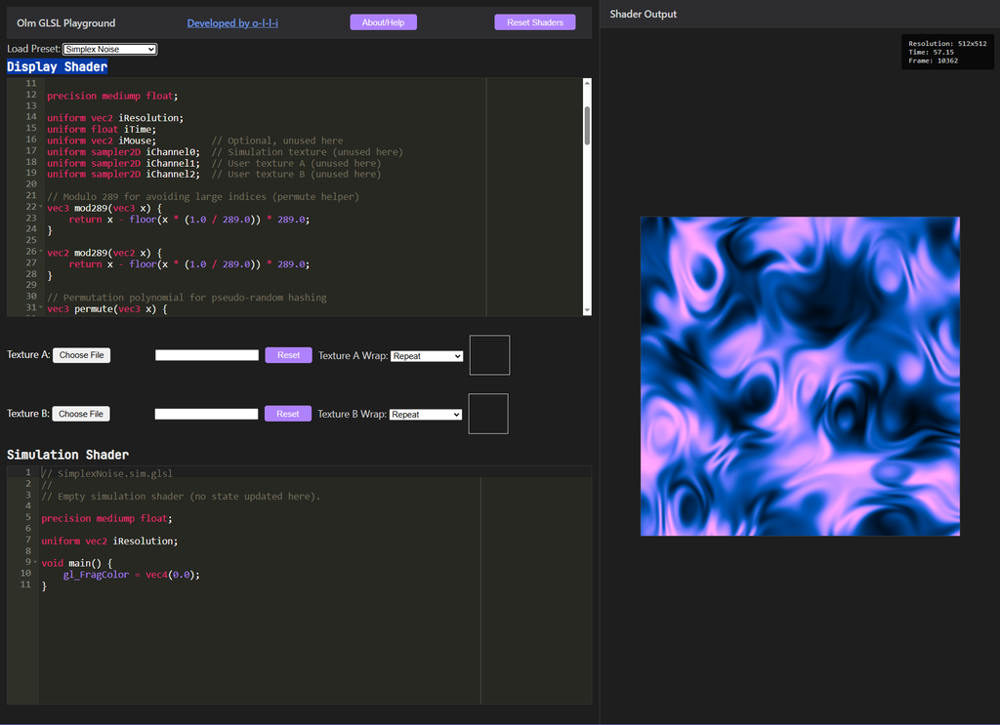

# Olm GLSL Playground

- **Author:** Olli Sorjonen
- **GitHub:** [github.com/o-l-l-i](https://github.com/o-l-l-i)
- **X:** [https://x.com/Olmirad](https://x.com/Olmirad)
- **Version:** 1.0.0 (Initial release)

## Try it here: 👇

👉 https://o-l-l-i.github.io/Olm-GLSL-Playground/

---

## What It Is

A lightweight web-based GLSL shader editor and viewer.
This tool lets you experiment with simulation and display shaders directly in your browser.

> Designed for tech artists, shader tinkerers, anyone curious about real-time graphics, and those who want ideas on how to set up this kind of coding playground.

Well, not really :D I was just fascinated how this kind of web-based coding environments function, so I decided to try set up one myself.

---

## What Can You Do?

- Edit **GLSL shaders** in two panels: simulation and display.
- Preview the results in real time.
- Load preset shaders and textures.
- Adjust texture wrap modes (Clamp/Repeat/Mirror).
- Get error feedback right below the editors.

---

## Features

- **Live GLSL Shader Editing**
  - Real-time fragment shader editing with instant preview.
  - Optional separate simulation and display shaders for multi-pass effects.
  - Syntax-highlighted editor powered by Ace Editor, using the GLSL mode.

- **Multiple Rendering Targets**
  - Supports multiple render targets (e.g., simulation → display → screen).
  - Double-buffered frame accumulation effects (e.g., trails, feedback loops).

- **Template and Example Shaders**
  - **Includes built-in shaders**:
  - Trail effects with fade
  - Mouse interaction visualizations
  - Simplex noise demos
  - SDF (signed distance field) shape blending
  - Texture deformation and blending
  - Debug/error fallback shader

- **Mouse Input Support**
    - Passes normalized mouse coordinates to shaders via iMouse.

- **Time and Resolution Uniforms**
  - **Automatically injects common uniforms**:
  - iTime: time in seconds since app start
  - iResolution: current viewport resolution
  - iChannel0..3: texture/simulation inputs

- **Local Persistence**
  - Automatically saves shader code to LocalStorage, preserving your work across sessions.

- **Texture Upload Support**
  - Load your own textures as shader inputs (currently supports 2 texture slots).

- **Modular WebGL Pipeline**
  - Cleanly separated vertex shader, simulation shader, and display shader stages.
  - Core rendering uses low-level WebGL for learning and transparency.

- **Error Feedback**
  - If a shader fails to compile, a fallback magenta error shader is displayed to alert the user.

- **Minimal, Vanilla JS Codebase**
  - No bundlers, frameworks, or dependencies.
  - Entirely implemented in raw HTML, CSS, and JavaScript — great for learning or hacking.

---

## How to Use

1. **Write GLSL code**
   Edit the simulation and display shaders using the ACE editor instances.

2. **Use Presets**
   Choose a built-in preset to load ready-made shaders and textures.

3. **Texture Controls**
   - You can reset textures to defaults.
   - Choose wrap modes (`CLAMP_TO_EDGE`, `REPEAT` and `MIRRORED_REPEAT`) from dropdowns.

4. **Mouse Input**
   Move your mouse over the canvas — it sends coordinates to the shader.

---

## Uniforms

- **iResolution**
  Texture resolution - Used to normalize UVs, etc.
- **iTime**
  Current time - Used to animate things.
- **iFrame**
  Current frame - Used often to detect 0 frame to perform setups, etc.
- **iMouse**
  Mouse position - Used to make reactive effects.
- **iChannel0**
  Simulation output - Used for accessing previous frame.
- **iChannel1**
  User texture A - Texture for any use you might want.
- **iChannel2**
  User texture B - Texture for any use you might want.

---

## Saving

- Your shaders are **saved to localStorage** as you type.
- If you reload the page, your code will be restored.
- ⚠️ There is no "export/save to file" feature *yet*.

---

## Limitations

- **No file saving**: You’ll need to copy your code manually to back it up.
- **No audio, webcam, or 3D input support**.
- No account or upload system.
- Only basic error handling from shader compiler.

---

## Why This Exists

This tool was built as part of a tech art portfolio - something functional, fun, and extendable!

It's not trying to compete with ShaderToy, but aims to provide a minimalist space to explore and experiment with GLSL.

Enjoy tinkering!

---

## License & Usage Terms

Copyright (c) 2025 Olli Sorjonen

This project is source-available, but not open-source under a standard open-source license, and not freeware.
You may use and experiment with it freely, and any results you create with it are yours to use however you like.

However:

Redistribution, resale, rebranding, or claiming authorship of this code or extension is strictly prohibited without explicit written permission.

Use at your own risk. No warranties or guarantees are provided.

The only official repository for this project is: 👉 https://github.com/o-l-l-i/Olm-GLSL-Playground

---

## Third-Party Libraries Used

- [Ace Editor](https://ace.c9.io/) - Licensed under the **BSD-3-Clause License**.
- [marked](https://github.com/markedjs/marked) - Licensed under the **MIT License**.

The licenses are included in THIRD_PARTY.md in this repository.

---

## Author

Created by [@o-l-l-i](https://github.com/o-l-l-i)